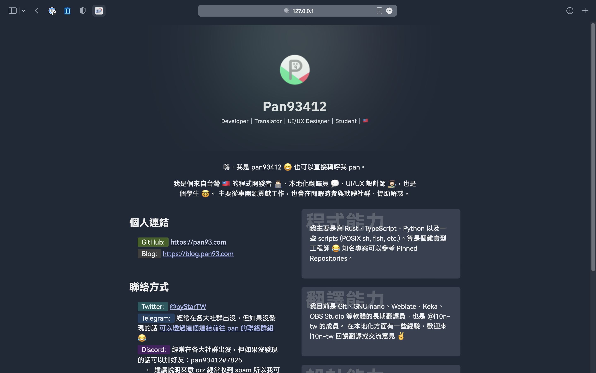
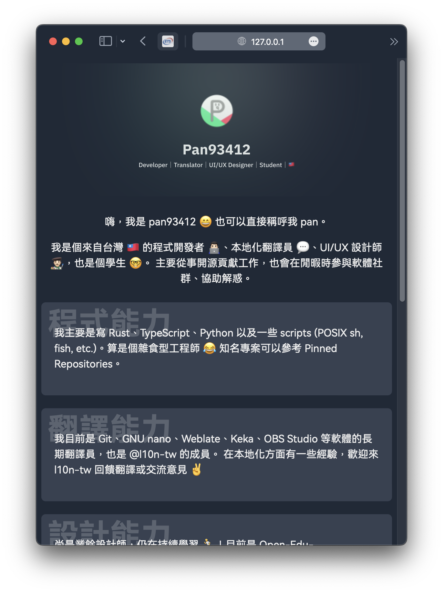
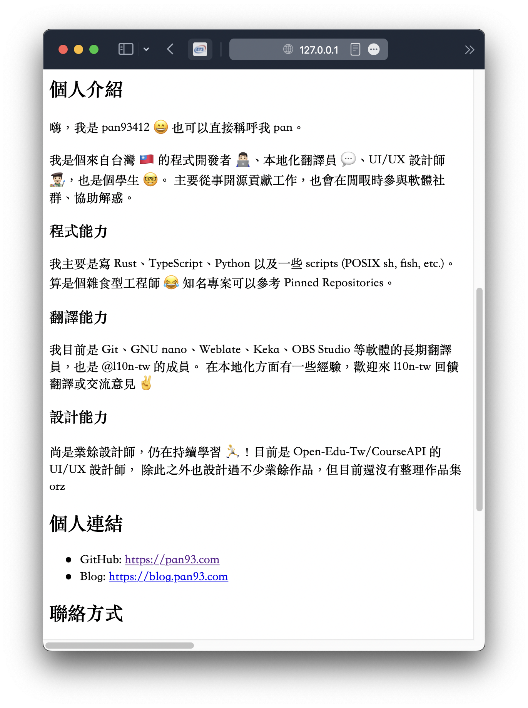

# Pan's Introduction Page

以 GitHub 上的自介為基礎，使用 Semantic HTML、自己定義的 design system，
以及 ES Module + TypeScript 打造出的實驗性個人介紹頁面。

## Tech Stack

- HTML
  - 使用 Semantic HTML 進行標籤。
  - 遵守 `h1`, `h2` 等 header 定義風格，便於在無 CSS 或
    非瀏覽器環境下能夠了解網頁結構。不過 CSS 會隱藏部分
    比較累贅的 header，增加視覺乾淨程度。
- SCSS
  - 以 SUIT 風格 BEM 為基礎，定義元件的 class。
  - CSS 的檔案是模組化的。
  - Design System 以 Tailwind CSS 為基礎繼續打磨。
- Scripts
  - 使用 TypeScript 撰寫，配合全靜態類型定義 (`declare`, 無 any)。
  - 使用 ES Module 技術，且動態載入 `hotreload.ts` 加速網頁載入。
  - 開發模式下，有包含啟用 Parcel Hot Reload 的 snippet。
  - 早期版本有增強網頁功能（如 `u-autolink`）的指令碼。
    - 後期達到 0 JS 目標，`u-autolink` 直接替換為 `href`。
    - 去除的 commit 時間點是 `1a2798d`。
- Bundler
  - 使用開箱即用的 Parcel。
    - 適合小專案，缺點是生態不足和 codebase 的潛在缺點。大專案更建議使用 Webpack。
  - 根據 `browserslist` 定義產生出 polyfilled 的 HTML / CSS / JS dist 檔案。
  - 壓縮等級已拉至較高等級。
- Linters & Formatters
  - `ESLint`: 只啟用 TS code smells 檢查，沒有 enforce 程式碼風格。
  - `Prettier`: 原則上採用 Prettier 預設風格。
  - `Stylelint`: 除啟用 SCSS/Standard/Prettier 規則外，亦導入 SUIT BEM Pattern 的驗證。
- Chores
  - `pnpm`: Much faster than `npm` & `yarn`.
  - `fish`: Opinioned shell.
  - `EditorConfig`: Match what `prettier` defined in VS Code.
  - `Git`: Version control.

## Screenshots

### Desktop

### Mobile

## Without CSS

